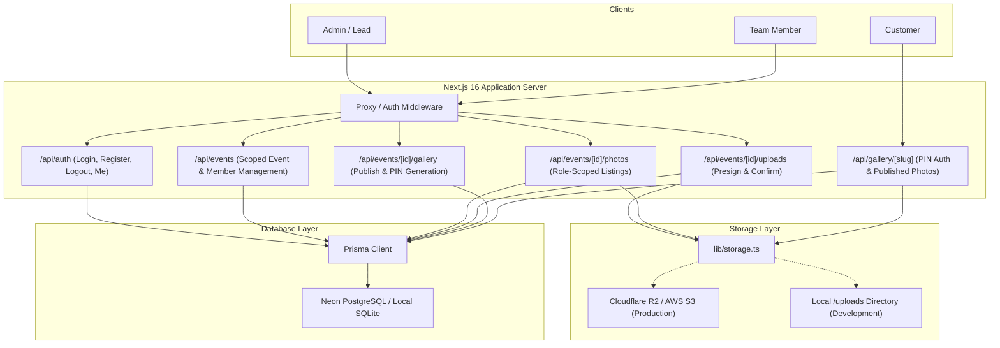
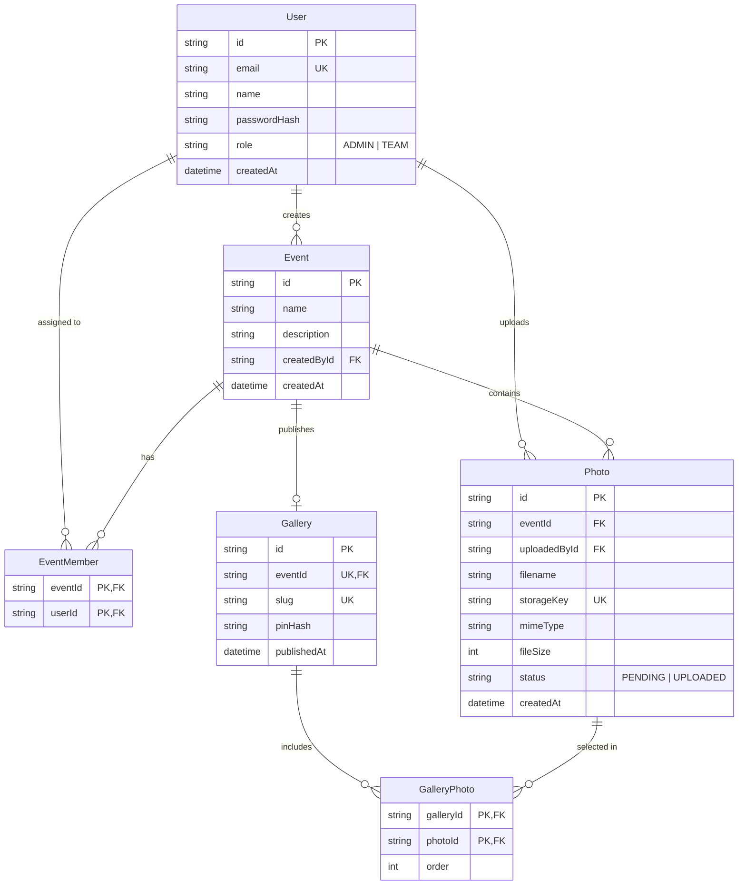

# Trizen PhotoShare — Collaborative Event Photography Platform

[](https://nextjs.org/)
[](https://www.prisma.io/)
[](https://www.typescriptlang.org/)

Full-stack event photo sharing application built for the **TrizenAI Full-Stack Internship Challenge**. Enables photography teams to collaboratively upload high-resolution photos for an event, allows an Admin/Lead to consolidate and select photos, and publishes a customer-facing gallery protected by a 6-digit PIN where clients access their photos without creating an account.

---

## 1. Quick Demo Credentials (Pre-Seeded)

The repository comes pre-seeded with full operational demo data:

| Actor | Email / URL | Password / PIN | Description |
|---|---|---|---|
| **Admin / Lead** | `admin@trizen.com` | `Admin@123456` | Creates events, assigns photographers, selects photos, publishes galleries. |
| **Team Member** | `team@trizen.com` | `Team@123456` | Uploads photos to assigned events, views own uploads. Cannot publish. |
| **Customer** | `/gallery/arjun-priya-wedding` | `482917` | Accesses public gallery via link + 6-digit PIN. No login required. |

---

## 2. Technology Stack & Rationale

| Layer | Choice | Rationale |
|---|---|---|
| **Framework** | Next.js 16 (App Router) + TypeScript | Unified modern full-stack architecture with React 19 server components and type-safe API route handlers. |
| **Database & ORM** | Prisma ORM with PostgreSQL (Neon) | Schema migrations, type-safety; the same Neon connection string serves local dev and production. |
| **Authentication** | JWT via `jose` + `bcryptjs` in HTTP-Only Cookies | Edge-compatible, stateless, secure session tokens with role-based claims. |
| **Object Storage** | AWS S3 / Cloudflare R2 with Local Adapter | Direct client-to-storage presigned PUT/GET URLs keeping image bytes out of the server and database. The local dev adapter mimics presigned URLs with HMAC-signed, expiring tokens and confines all reads/writes to the uploads directory. |
| **Styling** | Tailwind CSS v4 | Responsive, dark-mode glassmorphic user interface. |
| **Testing** | Node.js Native Test Runner (`node:test` + `node:assert`) | Fast, built-in, zero external version conflicts. |

---

## 3. System Architecture



---

## 4. Database Schema Design (Prisma)



---

## 5. Security Matrix — Handling of the 5 Mandatory Scenarios (PDF §6)

| # | Security Scenario | Architectural Enforcement |
|---|---|---|
| **1** | **User attempting to access another event** | Every `/api/events` and `/api/events/[id]/*` endpoint validates authorization server-side: Admins access all events; Team Members must have an existing `EventMember` join record. Non-assigned access yields `403 Forbidden`. |
| **2** | **Team Member attempting to publish a gallery** | `POST /api/events/[id]/gallery` requires `user.role === 'ADMIN'`. If a team member attempts to publish or forge a request, the server blocks execution with `403 Forbidden`. |
| **3** | **Failed photo upload handling** | Photos are initially created in a `PENDING` state with a presigned upload URL. The status is only promoted to `UPLOADED` after `POST /api/events/[id]/uploads/confirm` verifies that the file physically exists in object storage. Corrupt or aborted uploads remain unconfirmed. |
| **4** | **Incorrect gallery PIN** | Tested using constant-time `bcrypt.compare` against `pinHash`. An in-memory rate limiter locks out clients after 10 failed attempts per 15-minute window. Responses return a generic error without disclosing slug validity. |
| **5** | **Attempted access to unpublished photos** | Galleries are separate entities that only exist once published. Customer endpoints strictly join against `GalleryPhoto`. Unselected photos in the event have no join rows and are never served. Presigned GET URLs carry short expiration TTLs. |

---

## 6. Local Setup & Installation

### Prerequisites
- Node.js >= 20.6.0
- npm >= 10.0.0
- A free [Neon](https://neon.tech) PostgreSQL database (used for both local dev and production)

### Step-by-Step Setup
```bash
# 1. Clone the repository
git clone <repository-url>
cd trizen-photo-share

# 2. Configure environment variables
cp .env.example .env          # set DATABASE_URL to your Neon connection string
cp .env.test.example .env.test  # set a SECOND throwaway database URL (tests wipe it)

# 3. Synchronize database schema (creates the tables on Neon)
npx prisma db push

# 4. Seed demo users, events, photos, and published gallery
npm run seed

# 5. Run the automated test suite (isolated test DB — never touches your demo data)
npm test

# 6. Start development server
npm run dev
```

Open [http://localhost:3000](http://localhost:3000) in your browser.
With `STORAGE_DRIVER="local"` (default in `.env.example`) photos are stored in `./uploads` behind HMAC-signed, expiring URLs — no cloud account needed for local development. Set `STORAGE_DRIVER="s3"` with R2/S3 credentials to use real object storage.

---

## 7. Environment Variables Reference

| Variable | Description | Example / Default |
|---|---|---|
| `DATABASE_URL` | PostgreSQL connection string (Neon) — same for dev and prod | `postgresql://…neon.tech/neondb?sslmode=require` |
| `JWT_SECRET` | Secret key used to sign and verify JWT session cookies | `super-secret-key-32-chars-min` |
| `NEXT_PUBLIC_APP_URL` | Public base URL of the deployment | `http://localhost:3000` |
| `STORAGE_DRIVER` | Storage provider: `"local"` or `"s3"` | `"local"` |
| `UPLOAD_DIR` | Local disk folder for file storage when driver is local | `"./uploads"` |
| `AWS_ACCESS_KEY_ID` | Cloud object storage access key (S3 or Cloudflare R2) | Optional for local |
| `AWS_SECRET_ACCESS_KEY` | Cloud object storage secret key | Optional for local |
| `S3_BUCKET` | Target S3 or R2 bucket name | Optional for local |
| `AWS_REGION` | AWS region | `"us-east-1"` |
| `S3_ENDPOINT` | Custom endpoint URL for Cloudflare R2 or MinIO | `https://<id>.r2.cloudflarestorage.com` |

---

## 8. Deployment Guide (Cloud Production)

### 1. Database (Neon PostgreSQL)
1. Create a free account at [neon.tech](https://neon.tech) and spin up a new Postgres database.
2. Copy the pooled connection string into your environment variables as `DATABASE_URL` (locally and on Vercel).
3. Run `npx prisma db push` to create the schema.

### 2. Cloud Storage (Cloudflare R2 or AWS S3)
1. Create a private bucket (e.g., `trizen-photos`).
2. Generate an API token / access key with Read & Write permissions.
3. Set `STORAGE_DRIVER="s3"`, `S3_BUCKET="trizen-photos"`, and keys in your production environment.

### 3. Application Deployment (Vercel)
1. Push your code to GitHub.
2. Import the repository in [Vercel](https://vercel.com).
3. Under Environment Variables, add all keys from `.env.example`.
4. Deploy. Run `npm run seed` via Vercel CLI or one-time script to populate initial demo data.

---

## 9. Automated Testing

Run the test suite:
```bash
npm test
```

The script provisions the isolated test database configured in `.env.test` and runs the suite against it — your demo data in the main database is never modified. The 15 tests cover all 4 mandatory areas plus regression tests for the storage security fixes:

- **Area 1**: Authentication, password hashing, JWT claims, role-based authorization, and a live route-handler test proving registration cannot self-assign the ADMIN role.
- **Area 2**: Cross-event isolation (Scenario 1), role-scoped photo visibility, failed upload handling (Scenario 3), path-traversal rejection, and presigned URL signature validation.
- **Area 3**: Gallery publishing workflow, photo curation, re-publishing updates.
- **Area 4**: PIN hashing, rate-limiting brute-force defense (Scenario 4), gallery session token forging, unpublished photo isolation (Scenario 5).

---

## 10. Known Limitations & Future Roadmap

1. **In-Memory Rate Limiter**: The current rate limiter uses an in-memory sliding window. In multi-instance serverless deployments, upgrading to Redis (e.g. Upstash) provides distributed rate tracking.
2. **Dynamic Image Thumbnails**: Currently serves original uploaded resolutions; client-side image resizing and responsive srcset with Sharp or Cloudflare Image Resizing can be enabled for ultra-low bandwidth scenarios.
3. **ZIP Gallery Download**: Clients can download individual high-resolution photos; batch ZIP archive downloads can be added via asynchronous serverless background workers.
4. **Local Storage Adapter (development only)**: With `STORAGE_DRIVER="local"` the app stores files on disk under `uploads/` behind HMAC-signed, expiring URLs. This is a development convenience; production deployments use S3/R2 presigned URLs exclusively (the local route returns 404 when the S3 driver is active).
5. **Pending-Upload Cleanup**: Photos whose upload was aborted remain in `PENDING` status and are excluded from all listings; an automated reaper for stale `PENDING` rows is future work.
